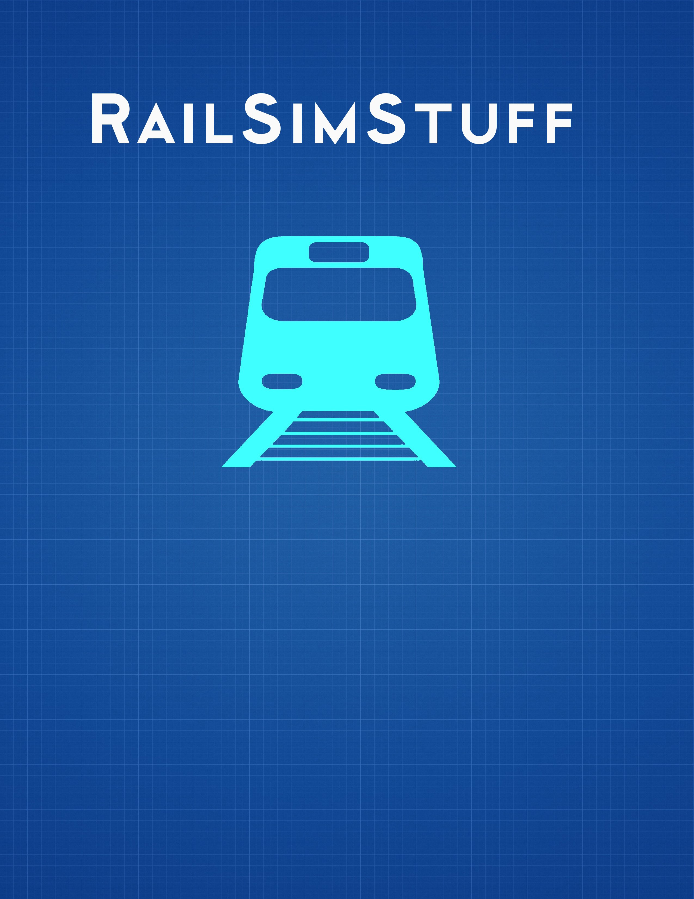

= Open Rails: Blender Content Creation Notebook
:toc:
:toclevels: 3
:sectnums!:
:sectids!:
:chapter-label:
:doctype: book
:author: Pete Willard
:email: petewillard@gmail.com
:homepage: http://www.railsimstuff.com
:revision: 2
:copyright: Copyright © 2020
:title-page-background-image: 
:encoding: utf-8
:lang: EN
:experimental:
:icons: font
:pdf-page-size: [8.25in, 10.9in]
:gr: `
:mu: µ
:ohm: Ω
:dot: *
:union: ∩
:degree: °
:C: ©
:arrow: →
:shift:
:bar: |
:bleft: [
:bright: ]
:hash: #
:bslash: \
:BL: {
:BR: }
:sourcedir: code
:source-highlighter: rouge
:OR: Open Rails
:MSTS: Microsoft Train Simulator

<<<
:numbered!:
[colophon]

Open Rails, Blender Content Creator Notebook

{copyright}  {author}  

Lettering:: This book is typeset using the Ubuntu TrueType font

Text Layout:: Ruby - ASCIIDOCTOR-PDF

<<<
== Open Rails, Blender Content Creator Notebook

{copyright}  {author}  

The information, computer programs, diagrams, documentation, or any
other material in or related to this book are provided `as is,` without
warranty of any kind, expressed or implied, including without limitation any
warranty concerning the accuracy, adequacy or completeness of the material or
the results obtained from the material or implied warranties. Including, but
not limited to, the implied warranties of merchantability and fitness for a
particular purpose are disclaimed.  The author shall not
be responsible for any claims attributable to errors, omissions, or other
inaccuracies in the material in this book. In no event shall the
author be liable for direct, indirect, special, exemplar, incidental, or
consequential damages in connection with, or arising out of, the construction,
performance, or other use of the material contained herein. Including, but not
limited to, procurement of substitute goods or services; loss of use, data, or
profits; or business interruption however caused and on any theory of liability,
whether in contract, strict liability, or tort (including negligence or
otherwise) arising in any ay out of use, even if advised of the possibility of
such damage. If you actually read all this, I salute you. You could have been more 
productive with your time but chose not to be.

== About This Document

This is a first attempt at a guide to using Blender with Open Rails for content creation.   For this document, the Long Term Support (LTS) version of Blender 2.8 will be used. Older versions of Blender will not be referenced or used.

=== About The Author

I am not an expert.  I can best be described as a curious user and occasional content creator. I've been an eternal novice with regards to content creation in general and there are going to be things that I still don't understand sufficiently.

From 2002 until 2016, all of my 3rd party content releases have been for Microsoft Train Simulator using 3DCanvas (Ultimately renamed to 3D Crafter)

Initially, I started with versions of Blender released before version 2.8 and it didn't seem to me to be very user-friendly. Due to the foereign and combersome nature of early Blender versions, I also didn't get very far with it.  When version 2.8 arrived, it was still hard to get started but it was a vast improvement.  Now, after seeing some of the basic modeling techniques available in Blender, I don’t think I will switch to a different 3D modeling tool anytime soon. 

=== Contributor and Resources

This document is made possible with the contributions and feedback from people like: 

* Wayne Campbell
* Erick Cantu
* Michelle McKell
* Dave Nelson
* Peter Newell
* Curtis Holt
* Darrin Lile
* Josh Gambrell
* and various Blender add-on authors

Useful resources:

* http://www.elvastower.com
* http://trainsim.com
* http://www.textures.com  You need to login to downloadfootnote:[The site offers Free Registration and free downloads once signed up]
* https://www.blendersecrets.org/
* https://curtisholt.online/
* https://blender.org
* https://www.coalstonewcastle.com.au/physics/

:numbered!:
[preface]
== Preface

Here is the list of things that I assume about the reader.

* You are new to Blender
* You are reasonably new to content creation for Open Rails
* You have Open Rails installed and working
* You have installed TSRE5 for Consist management
* You have a texture file editor that supports PSD, PNG and DDS formats.footnote:[A good example is the Paint.net, or GIMP which are both free] 
* You have some idea about how Open Rails (and MSTS) content is created
* You have a project in mind, but you understand that you will not create your Magnum Opus on a first try.

If you have prior experience with GMAX, Train Sim Modeler or 3D Canvas, it will be a plus, but it is not required.

=== Organization of This Document

As the title implies, this document is based on a collection notes I made while learning to make content for {OR}.  As a result, it may not be the most organized or useful document on the subjects discussed within it but it is primarily aimed at filling a void in the documentation set for {OR}.  This document is FREE and Open Source.  It will ultimately live on in the GITHUB repository.  This means that others are welcome to fork a copy, edit it to add sections or fix errors if desired.  The author does not claim unrealistic ownership of the ideas and concepts contained within.

Due to the way this document originated, it may seem to jump around and be repetetive at times. My apologies in advance if this bothers you but if you are so inspired, you are welcome to help fixing any errors, problems or omissions.

:sectids!:
:numbered!:
include::makingcontent.adoc[]
include::makingthemesh.adoc[]
include::reference.adoc[]

