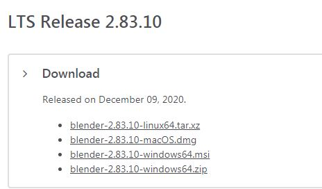
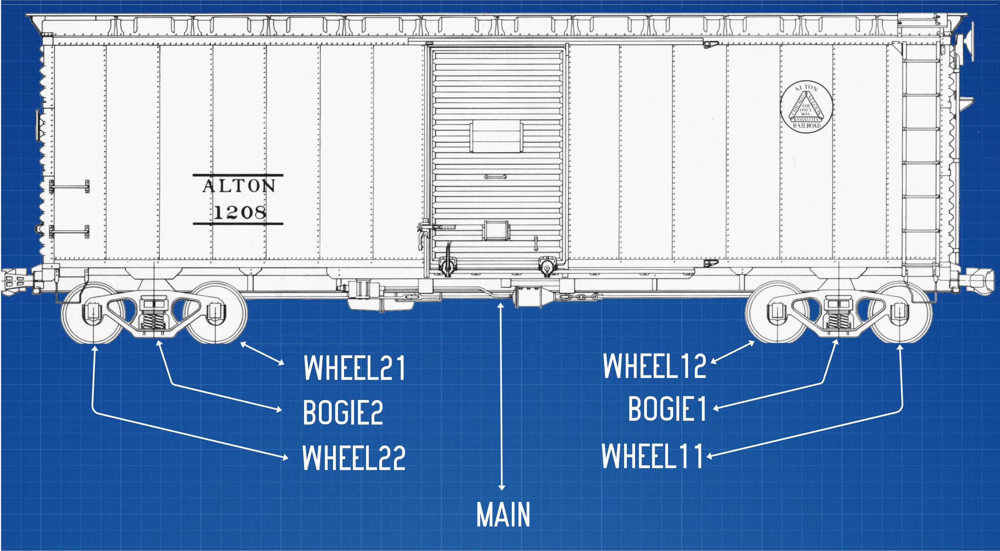

== Making content for ORTS 
 
  
About ORTS:: The Open Rails Train Simulator is an open source project that exists primarily because we never received the promised Microsoft Train Simulator 2. It strives to be backward compatible with nearly all existing MSTS content while adding new features and fixing old bugs that existed on the Microsoft/Kuju releases.  Very often, you can use MSTS and ORTS terms interchangeably, but keep in mind that ORTS can handle higher poly count (more complex) models than MSTS can. 

[NOTE]
The key advantage that Open Rails currently offers over Microsoft Train Simulator is that good frame rates can be maintained with a much higher number of polygons, so curves can be smoother and more detail can be modelled. Open Rails also displays 32-bit color (whereas Microsoft Train Simulator is limited to 16-bit). Another advantage is the longer viewing distances, adjustable from 2km out to 10km. -- _from OpenRails.org website_

Since this tutorial will be about using Blender, other 3d modeling tools will not be mentioned much inless its for a point of contrast.

=== Common Terms and Definitions

Alpha:: A bit map with a portion of the image that is masked-out, making the location appear see-though in the image.

Mesh::  A 3D Model "shape" made up of 1 or more "faces"

Face::  A surface created by 3 or more vertices.

Vertex::    (Plural = vertices ) a point in 3d space with x,y,z coordinates, often used as part of a location where edges and faces meet.  

Edge::  A line created by the linking of 2 vertices

Poly count::  The poly count is the amount of "polygons" used to create a 3d mesh. A polygon is made up of vertices.

Polygon::    Refers to the planar face of this closed shape, edges are the straight edges that define it, and points/vertices are where those various edges connect with one another. Blender calls these "tris", short for faces made of triangles and "quads", short for 4 vertex faces. 

TRI::   Faces made up pf 3 vertices, also referred to as triangles

QUAD::  Faces made up of 4 vertices

NGON::  Is a face with 5 or more vertices.

Hard Surface Modeling:: A generalized term for modeling objects that represent things like vehicles, buildings, weapons, roads. These make use of the more standard mesh techniques and objects like cube, cylinder, plane, cone, torus etc.

Normal:: A normal is a vector in 3D-space that is perpendicular to two other vectors (determined by two edges of a face)footnote:[See Wiki https://en.wikipedia.org/wiki/Normal_(geometry) ] A Normal controls the facing direction if applied textures.

Organic Modeling:: Modeling techniques that use a more sculpted approach for things like animals, people, plants, trees, and even automobiles. There are specialized modeling tools and techniques for this including _surface nurbs_ (Non-uniform rational basis spline, Google it ) and the Sculpting tab in Blender.

UV::    UV is the 3D modeling process of projecting a 2D image to a 3D model's surface for texture mapping. The letters "U" and "V" denote the axes of the 2D texture because "X", "Y", and "Z" are already used to denote the axes of the 3D object in model space, while "W" (in addition to XYZ) is used in calculating quaternion rotations, a common operation in computer graphics.

Manifold shape::   A manifold shape is a 3d object that considered to be water tight.  The vertices, faces and edges are aligned and connected in such a way that if you poured water into to the INSIDE of the object, none would leak out.  A default `cube` primitive is an example a manifold shape. 

ENG FIle::
    A definition of -- `more work here  (A lot actually)`

=== What you need to make ORTS 3D Modeled content:
 
* A mesh - Your 3D model
* A texture - A 2-dimensional bitmap image that you will apply to your model, commonly referred to as a 'skin'
* A UVmap of the mesh - Instructions on how to map your 2-dimensional texture to your 3d model 
* A configuration file or set of files that describes your content to the simulator
* A thumbnail jpg (optional but helpful)
* Instructions - Let's not leave the work half done

=== Programs you need:

* A 3D program, we will use Blender 2.83 LTS.
* An Exporter to MSTS/ORTS format, we will use Wayne Campbell's S file exporter from Elvas Tower web sitefootnote:[Download from https://drive.google.com/file/d/1Oykl70glvaFU1t4dqwSrl8vgMFdI-kMb/view?usp=sharing]
* If you are also making models for Trainz Simulator, note that the latest versions of Trainz will accept the native Blender FBX exporter file output.
* A paint program that has channels and layers (There are many options here)
* A text editor that handles UNICODE files

=== What I use:

* 3d Modeler: _Blender 2.83.10
* Bitmap tool: PaintShopPro Version 7, paint.net or Photoshop CS2
* UV/Shader tool: Blender has one
* Text Editor: _Microsoft Visual Studio Code_ 
* Metric Conversion Calculator (I have one built into hand held calculator, but you can use Google)
* A Scale calculator: Converting dimensions from a scale drawing. (there is on on my website at http://www.railsimstuff.com ) 

====  Why Blender?  

In 2002, I started using 3d Software to create content for games, primarily for {MSTS}, and I have worked with different tools on different projects and in the end I found Blender to now be my personal favorite. I have used Abacus Train Sim Modeler, 3D Canvas, Gmax and Sketchup and while 3D Canvas was my favorite for many years, my use of it now is only as a file format conversion tool. Blender has all that I want for making 3D models and many things that 3D Canvas doesn't have, including active technical support.  

With the open community supporting Blender as well as having a huge collection of handy addons, it gives you a range of possibilities to customize your Blender workspace and workflow.  While some add-ons are not free, most are reasonably affordable, with some as low as $1.

=== What I Can Recommend:

* 3D Modeler: Blender 2.8 LTS or 2.9. (if you are already well accustomed to Blender 2.79 its OK, but you will be on your own here) Did I mention that it is free?
* BitMap Tools: _Photoshop CS2_ (You can still get this for free from Adobe if you google for it) , _Paint.net_ (free), _PaintShop Pro_ (even version 7 still works), or download the latest version of GIMP for free.
* UV tool: You can use UV and shader tools that come with Blender
* Text Editor: _Microsoft Visual Studio Code_ or _Context.exe_  NOTE: CONTEXT is an abandoned editor, but it has a syntax highlighter for ENG and WAG configuration files available at steam4me.com website

=== How to Install Blender

According to the Blender.org website, a new version is released about once per quarter.  I'm going to assume you are installing blender on a Windows 64 BIT platform.  I would recommend that you download the `LTS` or Long Term Support version. 

NOTE: If you install Blender for FREE from STEAM, the STEAM Library interface will auto-update to the latest version of Blender for you by default.  As of today, January 2021, STEAM will install version 2.91.

Let's use the Blender installer from the *Blender.org* website. https://blender.org/download/

The recommended version will be under the link on the page referred to under `Looking for Long-Term Support? Get Blender 2.83 LTS`.  It can be found here:  https://www.blender.org/download/lts/

From here you see various download options available. Locate the `.MSI` option and download it.  Double-clicking the downloaded `.MSI` file will begin the install. The `.MSI` file does all the work.

[NOTE:]
Blender will default to using your `DOCUMENTS` folder for Models and your `%APPDATA%` folder to store program configuration data and addons under the "Blender Foundation" folder structure.  Blender will use unique entries for each version of Blender installed so it is perfectly fine to have multiple versions of blender on the same PC. 

[TIP]
APP DATA is normally a hidden folder in your windows file explorer.  You can reach the folder from a command prompt by typing `cd %appdata%`

<<<

=== Engine/Wagon Model hierarchy

For a model to work correctly in {OR}, there are some requirements that need to be met if you want to have the simulator properly automate animations for wheels and bogies that would still work in MSTS.

The way I have found to get the correct layout of a dual 2 axle `BOGIE` `WHEEL` arrangement is to have all wheels use the center of their axle as the pivot point and the bogie use its default center of mass as its pivot point. In general, all other parts in a model will use world origin as the pivot point.  

[NOTE]
The Main body part does not need to be called MAIN. Modelers have been using that as a convention since 2002 so it has become a standard thing to do but its not a requirement. The Blender `S` file exporter by Wayne Campbell only requires that you use `MAIN` as the name of the COLLECTION that refers to where your model objects reside.

[TIP]
Be careful with selecting all objects in object mode and then applying "all transformations", as it will reset all objects to have their origin (pivot point) become `world origin`. This would change the pivot points of the bogies and wheels.

=== Standard 2 Axle Bogies
If you are Looking at the model from the Left Side View, the forward direction of the model is facing right.  Starting at the right, the bogies and wheels are named according to the diagram above, where associated WHEELS parented to the related BOGIE1 or BOGIE2. 

If an additional axle is needed, use WHEELS13 or 23 located behind the bogie pivot relative to forward motion and shift wheel set 2 to the center of the related BOGIE. Its is important that the naming sequence remains (11 to 23) as shown in the diagram or wheels will turn backward and shift improperly in MSTS. 

[NOTE] 
You would not have a 2 axle BOGIE with WHEELS13 or WHEELS23.

=== Isolated Axles

The MSTS naming standard for isolated axles with non-bogie wheels, is  WHEEL1, WHEEL2, WHEEL3.

In ORTS, it appears that only the WHEEL and BOGIE prefix is required.

[WARNING]
Some MSTS documentation leads you to believe that a third bogie is possible in MSTS - it isn't.  BUT, if you are modeling specifically for {or}, then you should know that the simulator will properly animate anything with the correct BOGIE and WHEEL prefixes as long as you follow the guidelines for parenting and local pivot origins.

=== Configuration Files

Models of rolling stock and signals can take advantage of a few features which are only available in Open Rails and not MSTS.  Having a good understanding of the new ORTS features, by referring to the {OR} manual, can be helpful in creating more capable and accurate content.  While the current {OR} manual is a bit shy on content creation details, much of the information that is available about Microsoft Train Simulator content creation still applies.

While I'm not going to create a full guide to `eng` and `wag` files here in this document, we will need to create a working file if we plan to add content to {OR}.  Peter Newell's website has an in-depth look into creating good `ENG` and `WAG` files for {OR}.footnote:[https://www.coalstonewcastle.com.au/physics/format/]

=== Various General Notes about Content Creation

`Ok, a comprehensive collection of ENG WAG file stuff should be here...   todo.`

[.lead]
An interesting discussion occurred in 2017 about making these files better and more useful in the post-Microsoft Train Simulator world. 

[quote, Erick Cantu, 20 November 2017 ]
_____
For better and worse, KUJU defined all of the folder names we use in MSTS. With the development of the Include file concept (as applied to .engs and .wags) I concluded that something very much like KUJU's \common.cab directory tree was needed for .inc files. Using the examples of how payware vendors made use of folders in \trains I saw that sometimes they used \common.cab, sometimes they used a folder specific to their own product folder, and sometimes they used something "in between" -- a vendor named folder named for the unskined mesh (e.g., 3DTrains_FPack).

IMO KUJU's example of a CAB file, you will see a good template for locating the "include" files. After much experimentation I'm proposing am solution that addresses these needs:

* A folder for shared .inc files, much like what is in \common.cab.
Recognition that many end-users have routes and equipment from many countries and therefore it might be useful to group certain files for each country.

* Acceptance that many payware vendors sell the same mesh skinned for many railroads but when distributed they use a unique folder for each railroad.

* Addressing the easiest to solve problems with minimal commonality, where everything belongs in one folder.
_____

<<<

Proposal:
Within the `\trains` directory,

Add `\common.fleet`

and 

Add `\common.model`

Within both of those directories, add folders (one for your own country and others only as needed) for country codes. 

Examples:

----
\AUS Australia
\AUT Austria
\BRA Brazil
\CAN Canada
\CHE Switzerland
\CHN China
\CZE Czechia
\DEU Germany
\FRA France
\GBR United Kingdom
\HRV Croatia
\HUN Hungary
\IND India
\ITA Italy
\JPN Japan
\NLD Netherlands
\POL Poland
\RUS Russian Federation
\SVK Slovakia
\SVN Slovenia
\SWE Sweden
\UKR Ukraine
\USA United States of America
\ZAF South Africa
----

For myself, this means I will strive to have (at least) this format somehow:

`\common.fleet\USA`

and 

`\common.model\USA`

=== General Modelling Standards from Erick Cantu

[WARNING]
I'm not sure how much this applies specifically to MSTS and not {or}

* The top node's pivot should be 2 inches below the rail to ensure that wheels sit on the rails correctly.

* Cars should all use consistent resolution and be designed with a wide variety of systems in mind. This consistency should apply both between cars and between the constituent parts of the cars themselves, including the texture mapping. Ideally, triangle counts should be around 12,000 or less at the top LOD, with aggressive optimization of vertex counts through the limiting of hard edges and careful welding of UV coordinates wherever possible.

* Part of this consistency will be making the cars look good together, which means consistent air hose heights. I am willing to supply sample cars that can also be cannibalized for parts. If compatibility with all of the cars I am building is a goal, then the tips of brake lines should be 14.5" above the rail, extended to a position where it will meet the air hose on the next car, and held in place the way most are in the real world, with a chain or cable (I use a simple cable shape).

* Couplers going through other couplers are the worst, so it's probably best to have them as either part of the truck mesh (which is what I do) or have them linked to the trucks in the hierarchy. The exception, of course, is cars where the truck centers and couplers are far apart, such as autoracks, boxcars with end cushioning, and so on. Obviously, the couplers would have much too wide a range of motion through most curves under these circumstances.

* Keeping drawcall counts low is important. Keeping overall texture counts low is even more important. Carbodies should use both a single texture sheet and a single material for that sheet unless there is a need to have more than one material (e.g., for specular roofs on cars with flat sides). We can always place multiple car-bodies in a single sheet if a single square texture is not adequate. This has been my standard practice for freight cars for some time now.

* 1-bit alpha channels are acceptable only when alpha cutouts are perfectly square. Otherwise, use greyscale alpha and antialiased edges.

* The MSTS convention of having the underside of all freight cars be completely devoid of any geometry, leaving the user to see sky when the car is viewed from below. This flies in the face of the fact that bridges are a thing, so this practice is best avoided. Car undersides do not need to be complex, but they should be present.

* Generally, it's wise to use whatever units match your reference materials to avoid unnecessary conversions. For example, when I build a Boeing, I work in decimal inches. When I build an Airbus, I work in decimal meters. For most US stock, reference materials will be in inches.

=== Texture Mapping

* All main parts should be mapped to the same resolution, and texture resolution should be consistent with mesh resolution. I use a fixed resolution of 1/2 inch per pixel, meaning every two pixels is an inch. In 3DS/GMax, this is accomplished by using a UVW plane size that is half the size, in inches, of the texture sheet resolution (in pixels). For example, to meet my 1/2 per pixel resolution target with a 2048 x 2048 pixel texture sheet, the UVW plane would need to be 1024 x 1024 inches.

* To save real estate, I use a lower resolution of 1 inch per pixel for car undersides and interiors.

* One of the things that MSTS and OR model builders have traditionally needed improvement on is alignment across edges. You should be able to run a line from the car side to the car end or from the car side to the car top without having a mismatch at the edge. Striping around edges is not uncommon, so this is important.

*Splitting car sides into multiple sections is not recommended, as it adds unnecessary mesh divisions and UV coordinates. It may be necessary for very long cars, such as auto-racks, however, for most cars of 60 feet or less, it's really not necessary if you plan ahead. Using the top half of a texture sheet for one car and the bottom half for another creates a large, rectangular area to work with and allows for multiple cars to use a single texture sheet. Remember, Open Rails is sensitive to both drawCall counts and the total number of images across a train, so putting multiple cars in one texture isn't actually a bad idea.

